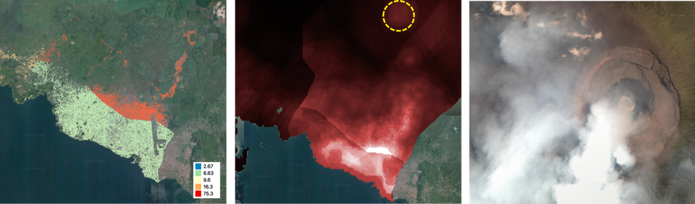
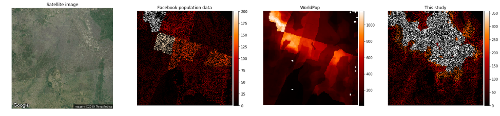

# population-data-hub

**Assessing errors and biases in gridded population datasets**

Population data are essential in humanitarian operations and policy making processes for sustainable developments. As the minimum scale unit of geospatial data analysis becoming finer, the demands for the higher resolution, disaggregated population data are also increasing. Census data are made available mostly in administration area level by surveys. These data are useful in large scale analysis and macro scale policy making, but too coarse to provide the necessary information on the population distribution within administrative boundaries. This undermines the ability to carry out the advanced geospatial analysis to serve population in the most vulnerable situation. Gridded, high resolution population data can enhance the advanced geospatial analysis for example, an accurate prediction of the amount of vaccine in the disease spread area, a population based human mobility model to forecast the spread of disease etc.

**Currently available gridded population datasets**

There are several gridded population data globally available.

|   | **Spatial resolution** | **Period covered** | **Source of data** | **Method** |
| --- | --- | --- | --- | --- |
| **GPWv4** | 5 - 10 km | 2000-2020 | census | Census extrapolation |
| **WorldPOP** | 100 m | 2015 | Geospatial covariates,GPWv4 | Random forest model,Dasymetric mapping |
| **Facebook high resolution population density** | 30 m | 2015 | High resolution satellite imagery, GPWv4 | Semantic segmentation, Dasymetric mapping |

A summary of currently available and widely used gridded population data.

Global Population of the World (GPW v4) data is produced by Columbia University&#39;s CIESIN group and in its 4th version. It provides extrapolated estimation of gridded population at 5-10km resolution between 2000 and 2020 based on census data. The census data are, in most of the cases, collected and processed into administration boundaries with the intentions to provide a broad overview of population distribution for macro scale policy making process. However, as the demands for more accurate and high spatial resolution population data increases, efforts have been made to produce higher resolution population density data - Worldpo and recently, Facebook population data.

Worldpop have introduced random forest based algorithm using multiple geospatial covariates as dependent variables and micro census data as independent variable. The weighting layer of worldpop represents the estimated population density in each 3 arc seconds (approximately 100 m at the equator) obtained using the Random Forest (RF)-based dasymetric mapping approach developed by Stevens et al. (2015). The weighting layer is then used to dasymetrically disaggregate population counts from administrative units into grid cells to obtain the final population distribution datasets. Facebook population density data, which has been recently made available at HDX website, provides population density map at 30 m resolution. Based on an assumption that the population counts should be made only in settlement area, they applied deep learning based algorithms to delineate built up area at 0.5 m resolution and aggregated into 30m resolution pixels. Boths datasets make improvements from GPW dataset in its own way. Facebook dataset provides unprecedentedly accurate information on built-up area with reported accuracy of 98% while worldpop dataset provides realistic representation of within boundary variation of population distribution at much higher resolution compared to GPW dataset. However both datasets suffer from the zoning boundary effects from the simple dasymetric method for disaggregation of census data at administration boundaries. Figure 1 depicts the issues in each population dataset.

Figure 1. Examples of  the issues in Facebook and Worldpop datasets in Nord Kibu, Democratic Republic of Congo. In both, Facebook (left) and WorldPop (middle) data, zoning effects are clearly seen due to the dasymetric disaggregation methods. Facebook data doesn’t account for the population variation within administrative boundaries. WorldPop counts population in areas (yellow circle in middle) where no population should be reported such as volcano area (right). Background imagery are provided by google.

Figure 2 shows more examples where those data fails to realistically represent population distribution 

**Future directions**

We have identified some issues in currently available global gridded population datasets. It was fairly clear that due to such issues, it is not recommendable to use those datasets as is in high spatial resolution geospatial analysis. With current phase of development in geospatial data and AI algorithms, we expect more and better gridded population datasets will be introduced in the near future.  In order to make a fast applications when such data are made available, a sound methods to measure the biases and errors in the new datasets are essential. On the other hand, the development of methods to take advantage of existing datasets to minimize errors and biases are also important.
